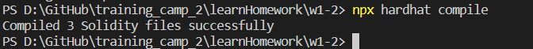
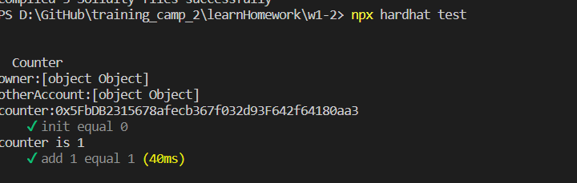
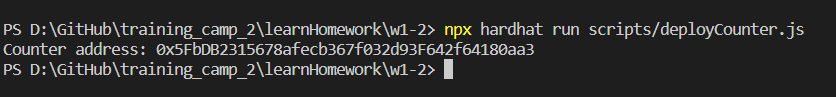
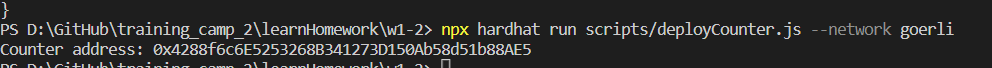
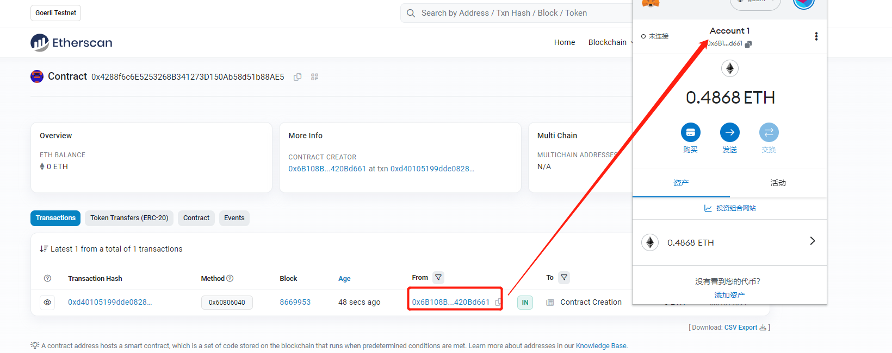
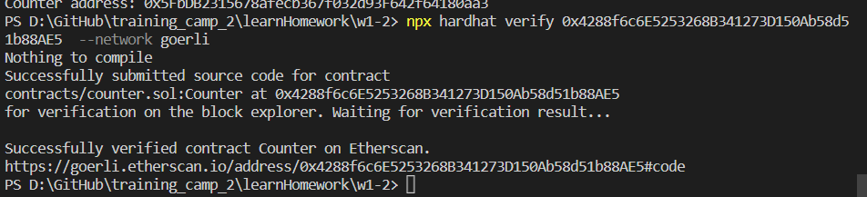
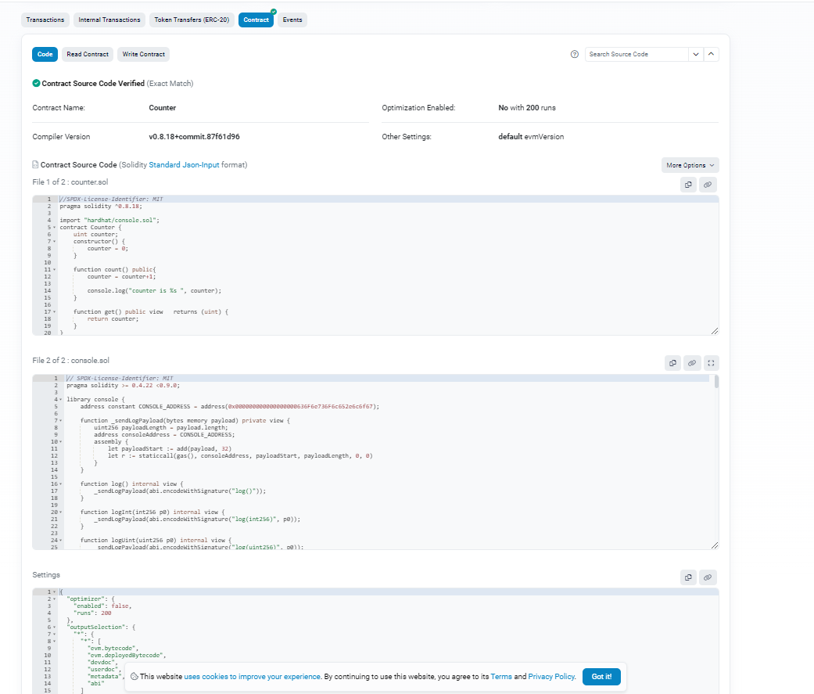
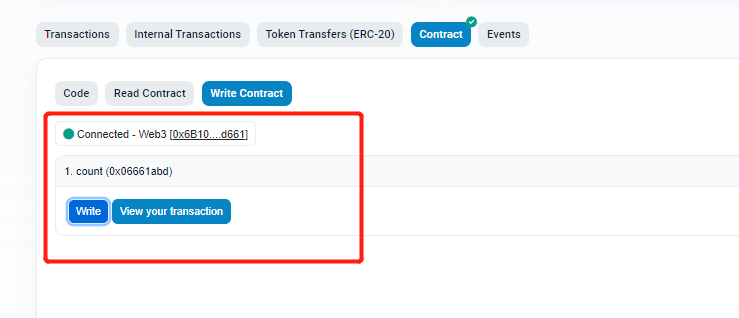
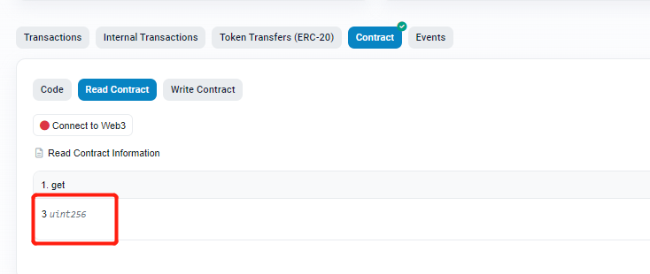

# Sample Hardhat Project

This project demonstrates a basic Hardhat use case. It comes with a sample contract, a test for that contract, and a script that deploys that contract.

Try running some of the following tasks:

```shell
npx hardhat help
npx hardhat test
REPORT_GAS=true npx hardhat test
npx hardhat node
npx hardhat run scripts/deploy.js
```
## 作业题目
• 使⽤ Hardhat 部署修改后的 Counter 

• 使⽤ Hardhat 测试 Counter 

• 写⼀个脚本调⽤ count()

### 合约编译
``npx hardhat compile``
>>
### 合约测试
在我们的测试中，使用 Harhdat 内置的网络，
使用ethers.js与前面的合约进行交互，并使用 Mocha 作为测试运行器。

测试代码文件是test\Counter.js
``npx hardhat test``
>>
### 合约部署到内置网络上
我们在测试时， 合约已经部署到了Hardhat 内置的网络上，部署合约我们需要编写一个部署脚本。

在scripts文件夹，新建一个deployCounter.js 用来写部署脚本
``npx hardhat run scripts/deployCounter.js``
>>

### 合约部署在goerli网络上

``npx hardhat run scripts/deployCounter.js --network goerli``
-- network 参数表示特定的evm网络
>>

* #### goerli合约地址
[goerli合约地址](https://goerli.etherscan.io/address/0x4288f6c6E5253268B341273D150Ab58d51b88AE5)

合约的owner地址：`0x6B108BD33842b49983C7c54c6C625387420Bd661`
>>

* ### 代码上传区块链浏览器

>>

 #### 安装`hardhat-etherscan`

``npm install --save-dev @nomiclabs/hardhat-etherscan``
 #### 配置 Etherscan API 密钥

在 hardhat.config.js 中配置
````
etherscan: {
    apiKey: ""
  }
````
 #### 执行命令
``npx hardhat verify 0x4288f6c6E5253268B341273D150Ab58d51b88AE5  --network goerli``
地址是上面部署完毕的合约

#### etherscan阅读源码，执行abi
[counter.sol在etherscan的源码](https://goerli.etherscan.io/address/0x4288f6c6E5253268B341273D150Ab58d51b88AE5#code)


>>

##### 1.连接web3钱包，执行abi的写方法count
加1
>>
##### 2.执行abi的读方法get
不用连接web3钱包。显示3，执行count方法后，会显示4
>>

##### 3.执行count方法的tx
[操作者tx列表](https://goerli.etherscan.io/address/0x6b108bd33842b49983c7c54c6c625387420bd661)

[合约tx列表](https://goerli.etherscan.io/address/0x4288f6c6e5253268b341273d150ab58d51b88ae5)